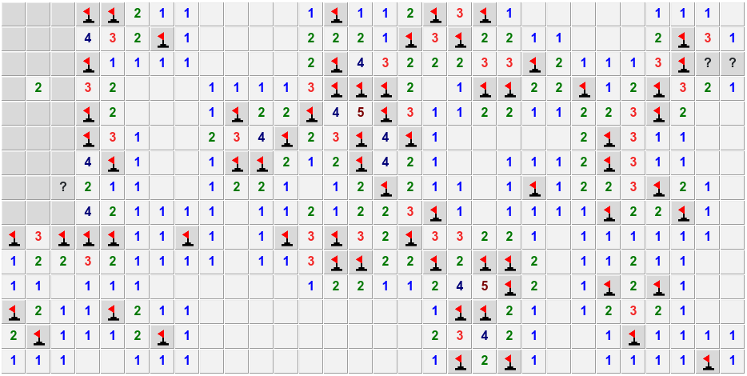

## Minesweeper game



### Description

The world-famous game. The number of mines, the width and height of the map are determined by the game settings

The very first cell opening of the game is safe (if there is a mine, the map will be rebuilt)

Realized with:

- Kotlin

- Ktor

- Exposed

- React

- Redux

Language: English

### Launching

1. Download or clone repo. Go to project directory in the terminal

2. Create your own credentials for backend (`.env` and `.env.test`), something like

```
POSTGRES_HOST=db
POSTGRES_PORT=5432
POSTGRES_USER=my_super_user
POSTGRES_PASSWORD=my_super_password
POSTGRES_DB=my_super_database

JWT_SECRET=my_super_jwt_secret
JWT_ISSUER=my_super_issuer
JWT_REALM=my_super_realm
JWT_EXPIRED=1111111
```

3. Create your own credentials for frontend (`client/.env`), something like

```
REACT_APP_BASE_API_URL='http://localhost:8080/api/v1'
```

4. Run docker containers (it will generate backend jar file and static pages for frontend)

```console
$ docker-compose up
```

5. Launch game on `localhost:3001` (or URL that you set up)

6. To create / update settings use admin profile. To assign admin role run

```console
$ docker-compose exec db psql \
"host=db port=5432 dbname=my_super_database user=my_super_user password=my_super_password" \
-c "UPDATE users SET is_admin = true WHERE email = 'myuser@email.com';"
```

(use your credentials)

7. Run tests

```console
$ ./gradlew test
```

### License

MIT – see `LICENSE`

### Contacts

Email me at:

```kt
"dcdl-snotynu?fl`hk-bnl".map { it.inc() }.joinToString("")
```
